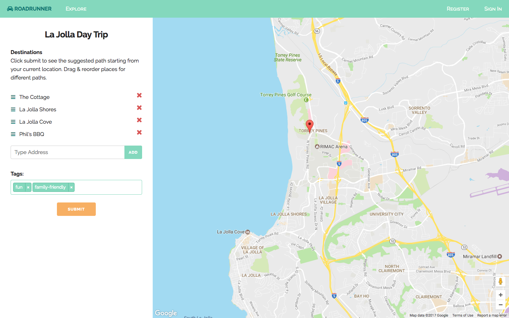
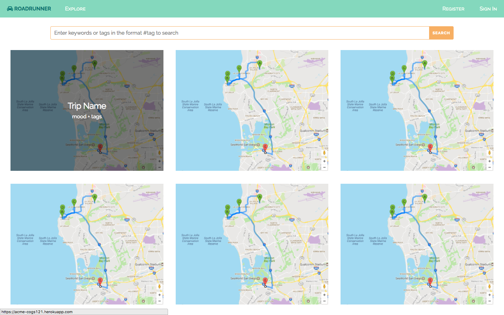
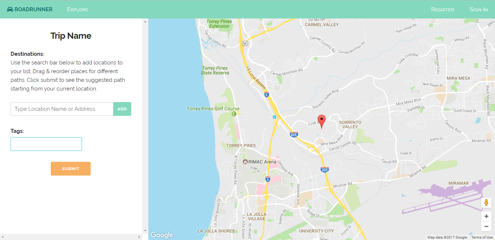

# Milestone 11
## Screenshots

We added the functionality to add tags to each list, so users can easily search and filter with these tags when exploring new destinations.

We also created the Explore page (with placeholder images for now). It has a search bar that will allow users to search and filter through lists. Each card will link back to a page that is similar to our homepage/map page that has the list of places and a map associated with it. As you can see, if you hover over a card, it will display the Trip Name as well as the mood and tags associated with the list.

We also started working on the Create page. It currently has similar functionality to our landing page but the directions have been altered to accommodate the creation of a new list. Ultimately, all of the customization features in the landing page will be moved to the Create page.

### Emily
I worked on adding tagging functionality to the map page. I also helped Christy with debugging CSS and styled some of the explore page (search bar). I also added style to the error messages in the modals. 

### Christy
I worked on implementing the UI (the grid layout of cards, hover text effect and search bar) for the Explore page and making it responsive for mobile devices. It currently doesn't have any functionality, but we wanted to get the grid layout of the cards and the search bar done.

### Mohsin
I worked on developing the create page. It currently has limited functionality since we are unsure if we plan to keep this as a separate page or somehow incorporate it as an edit feature in the My Lists page we will be implementing.  

### Arlen
