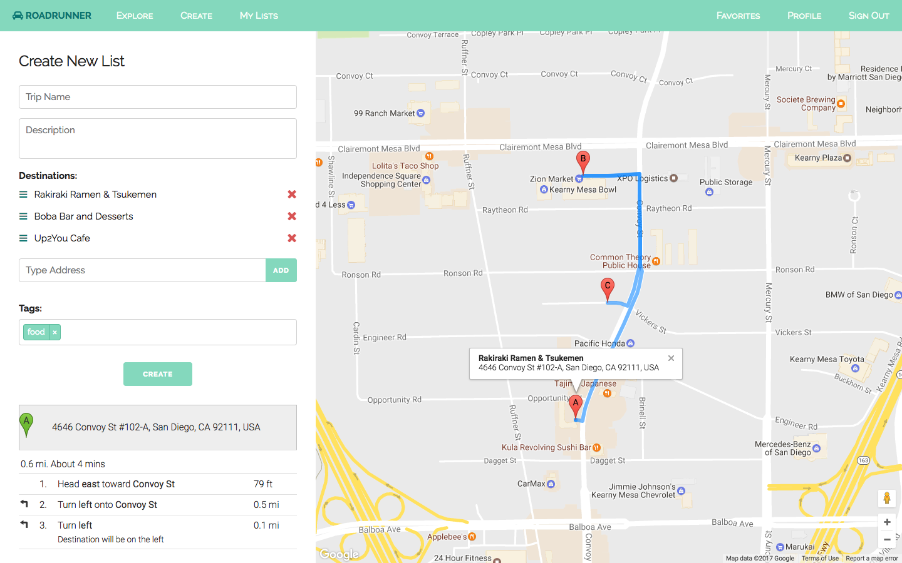
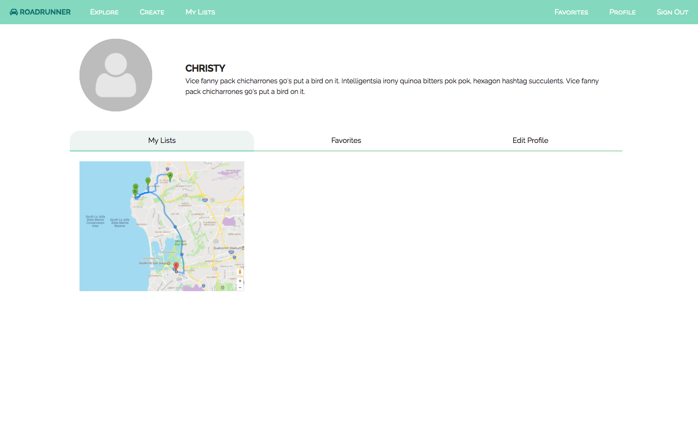

# Milestone 13
## Screenshots

We worked on the create new list functionality. We also modified the path so that it no longer starts at your current location because we felt like if users were using this to create a trip, they might not be starting from their current location. Therefore, we decided to start from the first location of the list. Also, we changed the infoWindow content so instead of just showing the address, it now displays both the name of the location and the actual address, so that users don't have to remember which address corresponds to which location.

We also worked on the UI for the profile page, which has separate tabs for the user's lists, their favorites and an option to edit their profile information.

### Emily
I worked on the UI for the profile page and modified the UI depending on if the user was logged in or not. There were a couple of bugs in the UI that were discovered. I fixed a mobile view issue with the modals on iPhones where only half of the modal would appear on the browser window.  

### Christy
I worked on modifying how the path displays for a trip's locations. The path no longer starts at your current location, but instead starts at the first destination. I also worked on changing the infoWindow content for each marker, so now each of them has the name of the destination as well as the actual address (so it's easier for users to distinguish which marker is which location).

### Mohsin
I worked on changing the search functionality for the create page. Currently, users type in the name or address of the location they want in the search bar on the side menu to add it. After doing some basic user testing, I found that this was a little confusing for some users since some places have multiple addresses with the same name. I worked on moving the search bar over to the map so that users are able to see all the relevant nearby locations on the map and choose which one they would like to add. I also fixed some bugs with the modals.  

### Arlen
