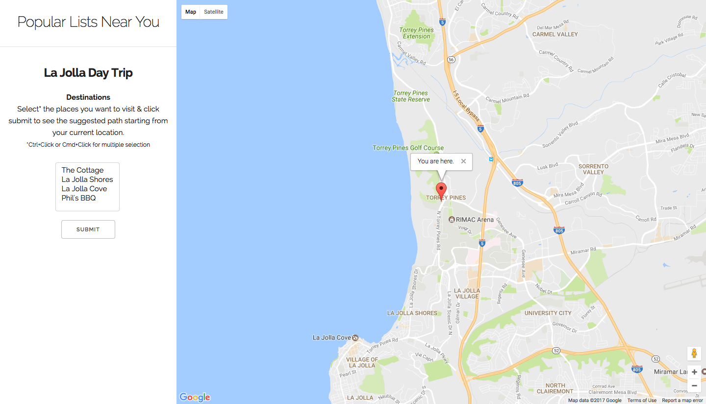

# Milestone 5
## Screenshots

The landing screen that gets displayed when the user first goes onto the site is a map that displays the user's current location (assuming they have allow the app to get their location) and a sidebar with popular lists near the user.

The user can select destinations from the list and the map will display a path starting from the user's current location, going through the selected destinations in the order of the list and ending with the last place selected from the list. There will also be directions displayed (driving directions for now) from each destination to the next.

### Emily

### Christy
I worked on setting up the map using the Google Maps API. I also worked on the simple map interaction for this milestone, which is displaying a path starting from the user's current location and going through the points/places the user selects from the fixed list of places we have on the left side. I also worked on displaying the directions for the path.

### Mohsin
I worked on the simple map interaction for this milestone. I worked to troubleshoot the displayed directions between waypoints and looked into adding customization for the waypoint markers and adjusting the route preferences.

### Arlen
I set up the infrastructure of the code and the development environment. We decided to use NodeJS with the Express wrapper combined with Handlebars templating due to our experience and familiarity with it. We also decided to use a SASS precompiler in order to make CSS easier. I worked on creating a dev script using parallelshell and nodemon in order to create a development environment that automatically refreshes the local server (and compiles SASS) every time a relevant file is updated.
