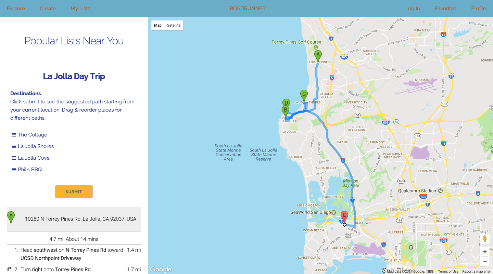
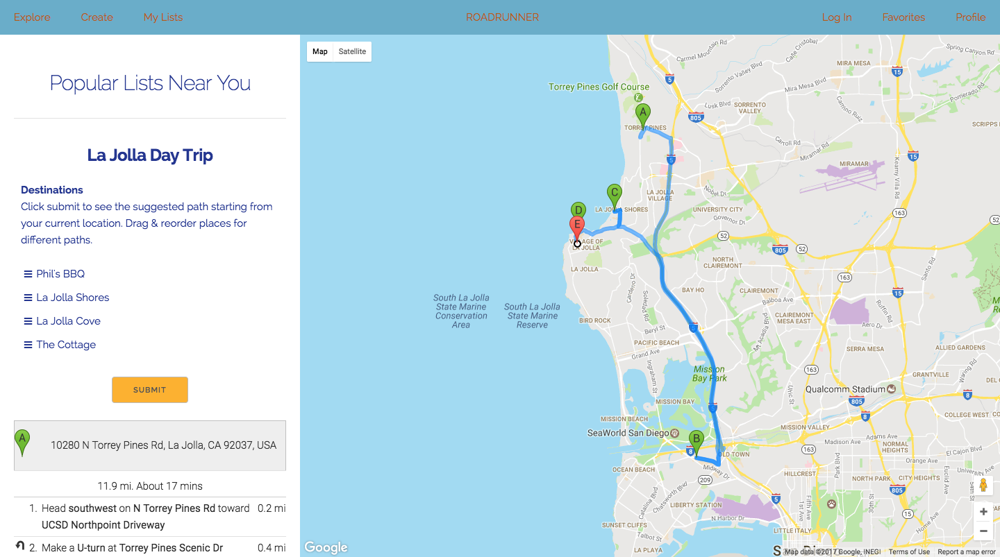

# Milestone 7
## Screenshots

For this milestone, we wanted to focus on implementing the reordering functionality of the list of places (drag and reorder). In this screenshot, the default list is submitted and the path is shown on the map.

In this screenshot, we reordered the list by dragging "The Cottage" and switching its order with "Phil's BBQ". We then resubmitted the list and a new path is displayed on the map.

### Emily

### Christy
I worked on implementing the drag and reorder functionality for the fixed list we have right now. I also worked on making the map redisplay the path once the user resubmits the newly reordered list.

### Mohsin
I experimented with customizing the waypoint markers and paths between destinations. I changed the default current position marker and applied a color scheme to the landing page and login modals.

### Arlen
I modified the navbar to become fully responsive with three flexbox settings based on media queries. I created a general modal class and the login/register modals and created two responsive layouts for the landing page. I also restructured SASS code to become more modular and easier to read.
