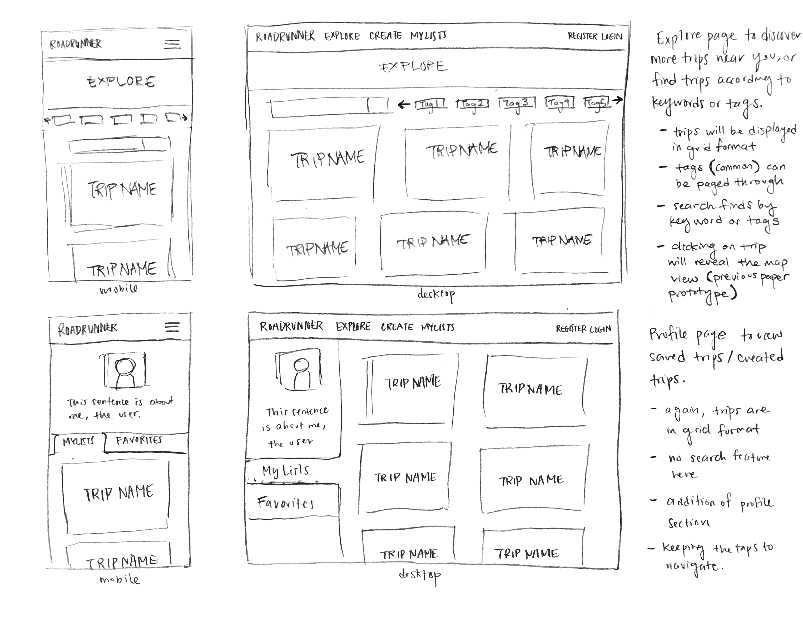
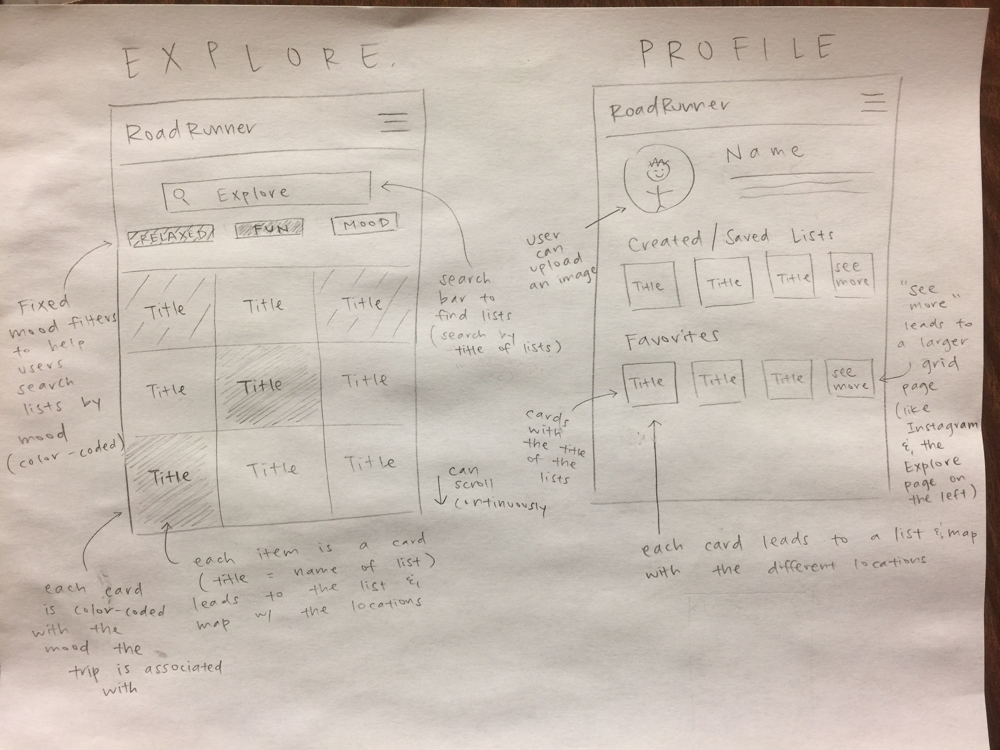
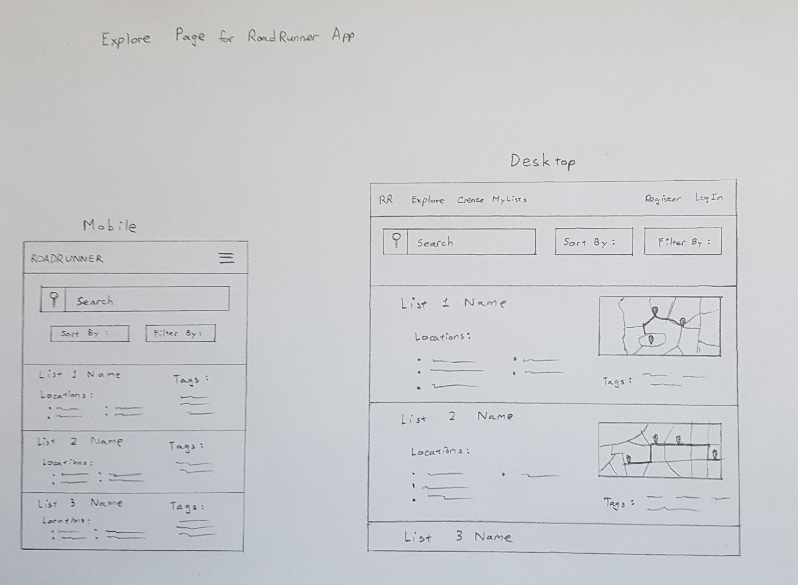
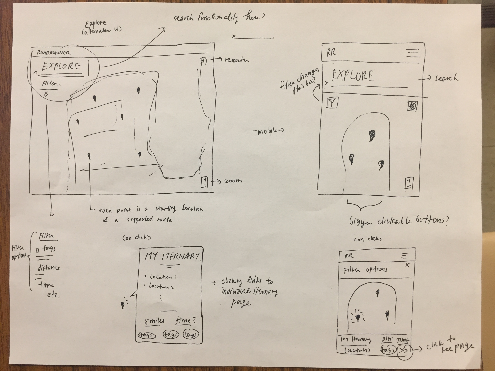

# Milestone 8

### Emily

This is a prototype for the Explore and Profile page. The layout is based on grids/cards that the users will be able to scroll through. On the Explore page, users will be able to search for specific keywords or tags. There will be a fixed amount of tags based on moods that users will be able to page through with the arrows and look at. Selecting tags will filter out trips. On the Profile page, users will have their own profile picture and description. They'll also have a two pages containing their saved trips and their own created trips. On either page, selecting a trip will lead them to the map view.

### Christy

This is a paper prototype of the Explore page and the Profile page. For the Explore page, users can search with the search bar and type in the title of the list/trip. They can also filter by mood (fixed number of moods). Each card is also color-coded with the mood of the trip. For the Profile page, users can upload an image for themselves and it will also display the lists they created/saved and their favorite lists.

### Mohsin

This is a prototype of the explore page in our app. It would display lists in the nearby area and users would scroll through the list to choose one they want. If they were looking for a specific list by name, they would use to search bar. Users also have to option to narrow the number of displayed lists with the sort and filter buttons. They would be able to sort by distance or number of locations and filter by tags. Each list displayed would have its name, the locations it contains, and the tags associated with it. On desktop, each list would also show a minimized map view of the overall route.  

### Arlen

This is also an alternative design of the explore page of our application. It instead tries to put suggested locations on a single map based on starting point which allows points to be continually generated and show up on the map as the user browses around. Futhermore, options are searchable and filterable in this iteration of the explore map.
