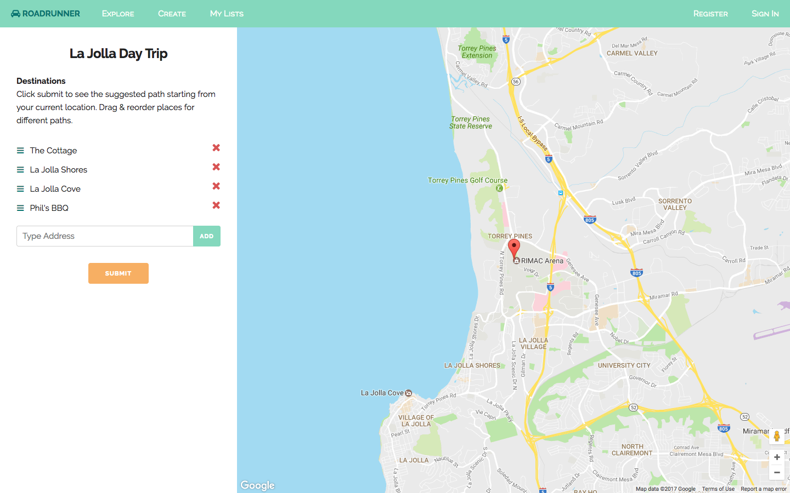
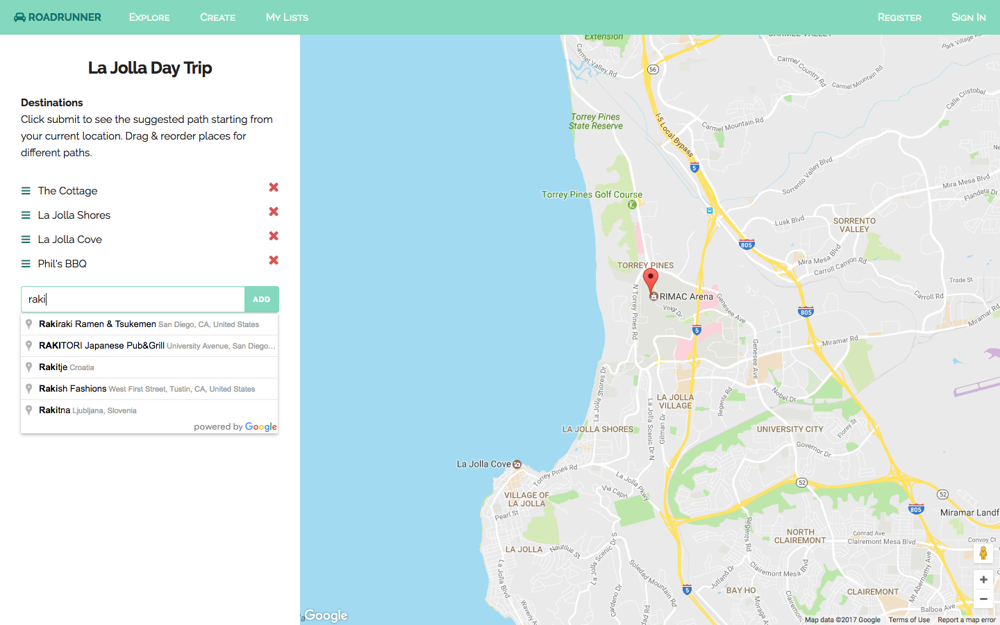
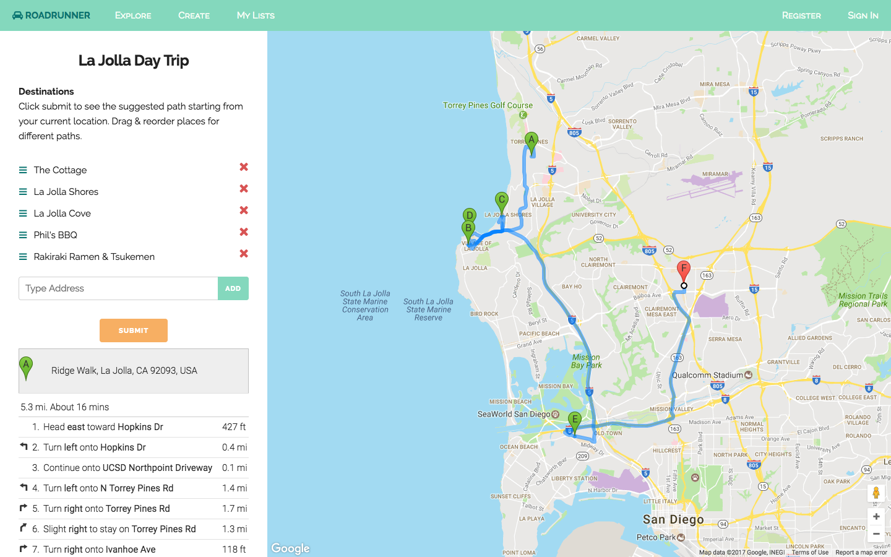
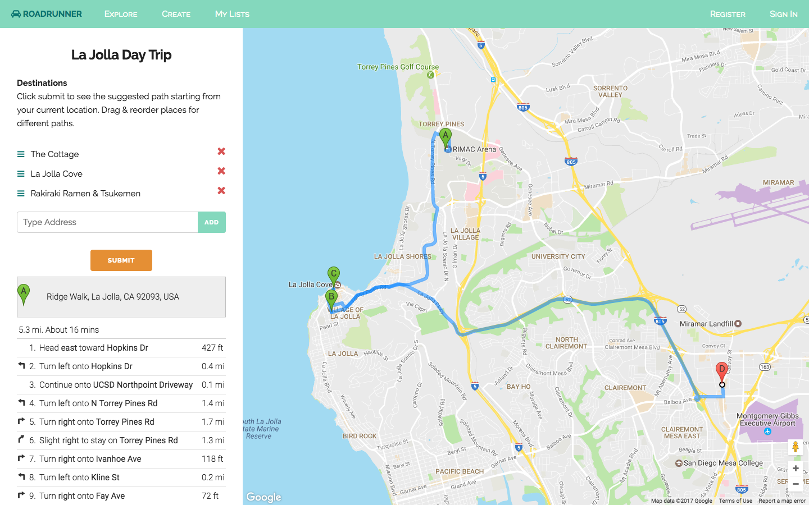
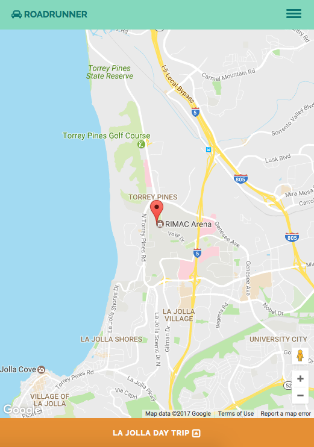

# Milestone 9
## Screenshots

We improved the UI for the overall app in this milestone.

For this milestone, we focused on doing the add and remove functionality for the list. Here, we have the add function, with autocomplete, allowing users to easily add new places to the list.

Once the user adds a new place and clicks Submit, they will be able to see a new route that includes the newly added destination.

We also worked on the remove functionality (each destination has an "X" associated with it, allowing users to delete a place once they click on it). Once they resubmit after removing places, a new path gets generated on the map.

We also worked on making the app responsive on mobile devices. When they click on the "La Jolla Day Trip" banner, the list/trip slides up, showing the destinations.

### Emily
I worked with Christy on refining the list reordering functionality and getting the map to update according to the new adjustments. I reworked the UI to make it more mobile friendly and changed the color theme. I also implemented the UI interactions so that the toggling works on the register and signin modals as well as the side menu toggling on mobile view.

### Christy
I worked on the functionality for adding additional waypoints for the fixed list, so that users can add other locations to the list and be able to see a path including the newly added places. I also worked on adding the autocomplete when adding waypoints and worked with Emily to make the drag and reorder functionality work on mobile. I also changed the map viewing options, so there are no longer terrain and satellite options.

### Mohsin
I worked on displaying location names on the waypoint markers as well as in the directions display. I also worked on troubleshooting the search box being covered up in mobile view when clicked on.

### Arlen
